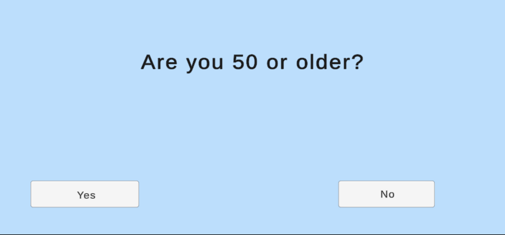

# Lung Quest
A decision-based game exploring the clinical trial journey for lung cancer patients.

## Concept
Lung Quest is an educational, decision-based game that simulates the clinical trial process for lung cancer patients. Players step into the role of a fictional patient and answer a series of eligibility questions based on age, smoking history, diagnosis, and lifestyle factors.

Based on their answers, players are either:
- Guided through treatment trial options (aggressive or palliative), or
- Shown why they may not qualify — all within an interactive, user-friendly format.

This project aims to increase awareness of clinical trial access and decision-making through gamified healthcare storytelling. Designed for accessibility and clarity, *Lung Quest* empowers users to understand the trial journey in a simple and engaging way.

---

## Flowchart
### Game Logic Flow

---

## UI Mockups (Canva)

### Home Screen

### Eligibility Question

### Trial Choice

---

## Unity Game Screenshots

### Start Menu (Unity)

### Eligibilty Question (Unity)

### Treatment Choice Question (Unity)

### Outcome Screen (Unity)

---

## 📂 Files & Folders

- `UnitySourceFiles/` – Full Unity source (Assets + ProjectSettings)
- `README.md` – Project summary and documentation

---

## 🛠 Tools Used

- **Unity** – Game development engine  
- **Lucidchart** – Flowchart design  
- **Canva** – UI screen mockups  
- **GitHub** – Version control + project hosting  
- **Visual Studio Code** – Editing & Git integration  

---

## Download the Game Build

Download full project zip (Unity game build + portfolio):  
[Lung Quest – Portfolio + Game Build (.zip)](https://drive.google.com/file/d/1L-dqqt3K3ADcafoNnitZ7G5OoLNXdd3S/view?usp=sharing)

---

## Author

**Heritage Adigun**  
Aspiring computer scientist with a passion for healthcare innovation & accessible tech
